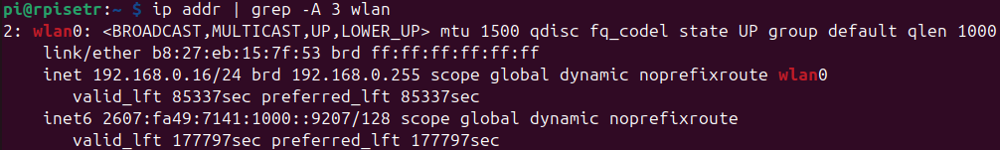
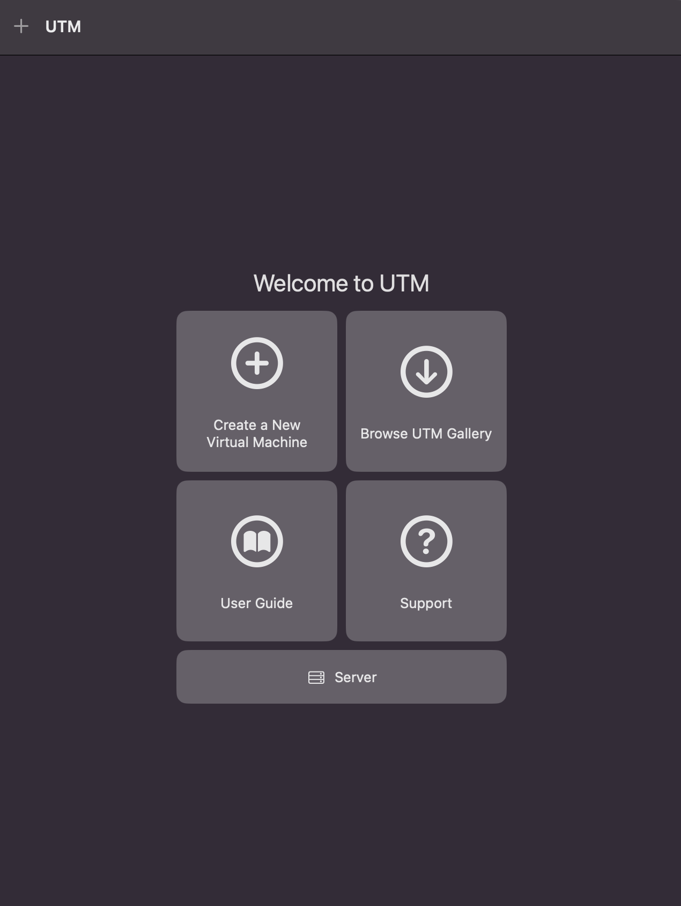
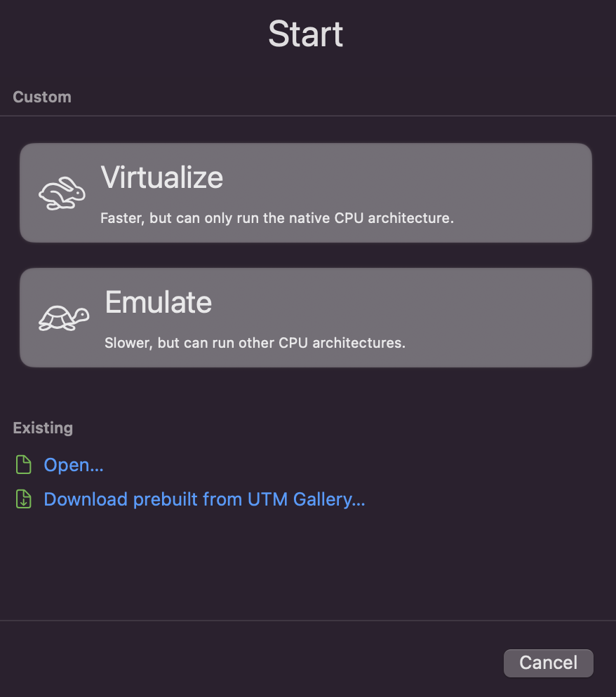
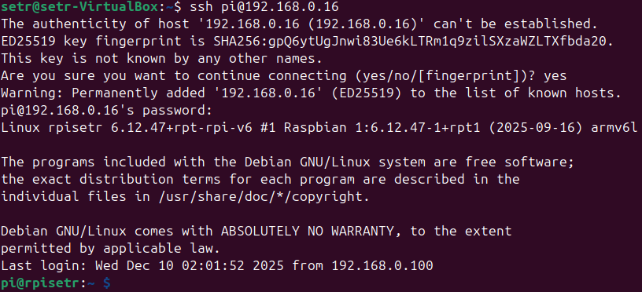
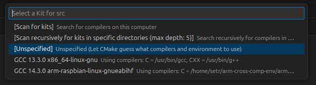
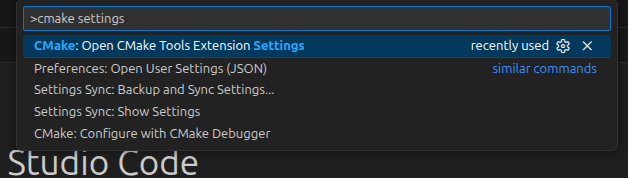
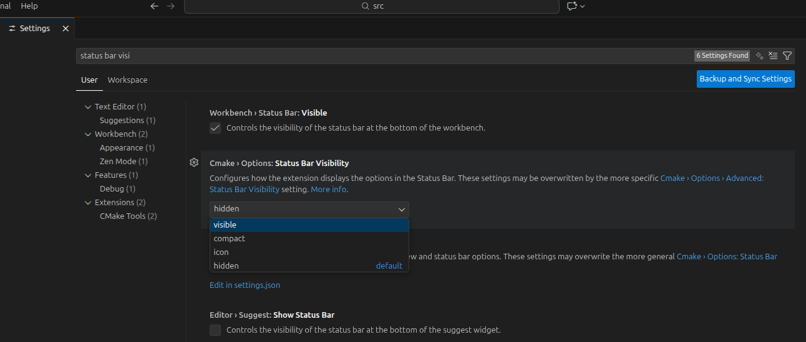

## 1. Objectifs

Ce travail pratique vise les objectifs suivants :

1. Mettre en place un environnement de développement complet;
2. Comprendre les mécanismes derrière la compilation croisée;
3. Préparer la configuration d'un noyau temps réel;
3. Maîtriser les rudiments du débogage et du profilage à distance;
4. Analyser et déboguer un code C simple;
5. Se familiariser avec l'utilisation du Raspberry Pi Zero W.

### 1.1 Survol du laboratoire

Dans ce laboratoire, vous devrez :

1. Configurer votre Raspberry Pi Zero W pour le connecter au WiFi et en prendre le contrôle à distance;
2. Installer et configurer la machine virtuelle contenant l'environnement de programmation du cours;
3. Utiliser cet environnement pour compiler et installer un noyau (kernel) Linux temps réel sur votre Raspberry Pi Zero W;
4. Compiler et déboguer un programme C simple en compilation croisée.

> **Important :** le Raspberry Pi étant un ordinateur à part entière, il est techniquement possible de n'utiliser que ce dernier et y travailler localement en se passant de l'environnement de développement à distance. Cela n'est toutefois pas représentatif du développement des systèmes embarqués en pratique, où il est souvent impossible de travailler directement sur le matériel cible, que ce soit par manque de puissance ou par d'autres problèmes pratiques (pensons par exemple à un Raspberry Pi embarqué dans un dispositif lourd et encombrant). De plus, pour beaucoup de travaux, la puissance limitée du Raspberry Pi Zero W et son nombre de ports limité rendraient malaisée une telle utilisation. Par exemple, dans le cadre de ce premier laboratoire, la compilation du noyau Linux devrait requérir moins d'une dizaine de minutes sur votre machine virtuelle, mais demanderait plus d'une heure sur le Raspberry Pi Zero! Pour toutes ces raisons, dans le cadre du cours, *il vous est interdit d'utiliser le Raspberry Pi de cette manière*, sauf lorsque qu'expressément autrement mentionné dans un énoncé ou autorisé par le professeur.

### 1.2 Choix du niveau de détails

Les énoncés de laboratoire sont conçus pour donner un niveau de détails suffisant pour tout le monde. Toutefois, il se peut que vous sachiez déjà comment réaliser certaines tâches. Dans cette optique, les instructions sont généralement divisées en 2 portions :

1. Ce que vous _devez_ faire
2. _Comment_ vous pouvez le faire

La partie 1 est toujours affichée. Afin d'alléger l'énoncé, la partie 2 est, quant à elle, souvent cachée sous un bloc _Plus de détails_, semblable à celui-ci :

<details>
<summary><span style="color:#000099;font-weight:bold">Plus de détails</span></summary>
Ceci décrit des détails supplémentaires sur la manière suggérée de réaliser l'action demandée.
</details>

Vous êtes libres de sauter ces sections si vous êtes certains de savoir comment faire. Toutefois, avant de poser une question, assurez-vous que vous n'avez pas oublié de consulter l'un de ces blocs.

## 2. Préparation du Raspberry Pi

La carte MicroSD du kit qui vous a été fourni **contient déjà** l'image système nécessaire au cours. Toutefois, dans le cas où vous recevez un kit avec une MicroSD non-initialisée, que vous voudriez revenir à l'état initial de l'image, ou simplement créer une copie, vous pouvez télécharger le fichier *.img* contenant l'[image du cours](http://wcours.gel.ulaval.ca/GIF3004/setrh26/setr2026_rpizero_image.zip).

<details>
<summary><span style="color:#000099;font-weight:bold">Plus de détails</span></summary>
Ce fichier (une fois extrait de l'archive ZIP) doit être copié en mode bas niveau (pas seulement une copie du fichier lui-même!) sur une carte MicroSD d'une capacité d'au moins *32 GB* (par exemple en utilisant `dd` sous Linux, ou un programme tel que [Rufus](https://rufus.ie/en/) sur Windows).
</details>


### 2.1. Démarrage et changement de mot de passe

Insérez la carte MicroSD avec l'image du cours dans la fente prévue à cet effet sur le Raspberry Pi. Branchez un écran (une sortie HDMI est disponible, n'oubliez pas d'utiliser le convertisseur mini-HDMI vers HDMI) ainsi qu'un clavier (utilisez la prise USB _la plus proche du port HDMI_ pour brancher le clavier et la plus éloignée pour l'alimentation). 

> Note : la sortie HDMI du Raspberry ne s'active au démarrage que si un écran y est branché. Si son port HDMI n'a pas été utilisé lors du démarrage, brancher un écran par la suite ne fonctionnera pas. Assurez-vous qu'un écran soit branché _avant_ de brancher le câble d'alimentation du Raspberry Pi Zero W pour éviter ce problème.

Le système ne demande pas d'authentification lorsque accédé localement (autrement dit, avec un clavier branché directement sur le Raspberry Pi Zero), mais à titre informatif, les identifiants du compte par défaut sont les suivants :

* **Nom d'utilisateur** : _pi_
* **Mot de passe** : _setrh2026_

#### 2.1.1 Changement de mot de passe

Nous vous recommandons **fortement** de remplacer ce mot de passe par défaut par un mot de passe plus sécuritaire (et connu de vous seul). Pour changer votre mot de passe manuellement, utilisez la commande `passwd` dans le terminal.

> **Important** : modifiez le mot de passe avant de vous connecter sur un réseau, sinon tout le monde pourra accéder à votre Raspberry Pi et son contenu!

### 2.2. Réseau sans fil

Ensuite, vous devez configurer votre Raspberry Pi pour qu'il se connecte au réseau sans fil.

#### 2.2.1. Eduroam

Si vous êtes sur le campus, nous vous suggérons d'utiliser Eduroam2 (le réseau accessible au laboratoire). Nous vous fournissons déjà un fichier de configuration pour ce réseau dans `/etc/NetworkManager/system-connections/eduroam2.nmconnection`. Éditez ce fichier pour y ajouter votre IDUL et votre NIP, puis redémarrez le Raspberry Pi avec la commande `sudo reboot`. 


<details>
<summary>Plus de détails sur l'édition en ligne de commande</summary>
Si vous n'êtes pas familier avec les éditeurs de texte en console, nous vous suggérons d'utiliser `nano` (par exemple, dans ce cas-ci, `sudo nano /etc/NetworkManager/system-connections/eduroam2.nmconnection`). Une fois vos modifications effectuées, utilisez Ctrl+X pour quitter, puis Y (pour enregistrer vos modifications) et Enter (pour conserver le même nom de fichier). Si vous êtes familier avec d'autres éditeurs, vous êtes évidemment libre de les utiliser.
</details>

#### 2.2.2. Votre propre réseau

Utilisez la commande `nmtui` dans le terminal et suivez les instructions. En général, il suffit de sélectionner `Activate a connection` ou `Edit connection` (dépendant des réseaux déjà enregistrés), puis de sélectionner le réseau sur lequel vous voulez vous connecter et de fournir votre mot de passe. Une fois la configuration terminée, la connexion devrait se faire dans un délai de 15 à 20 secondes.

> Note : si, sur votre propre réseau, vous observez des lenteurs anormales ou des déconnexions fréquentes dans vos connexions SSH (ex. lors de vos sessions de débogage), essayez d'ajouter la ligne `IPQoS cs0 cs0` à la fin du fichier `/etc/ssh/sshd_config`. Voyez [cette page](https://discourse.osmc.tv/t/solved-ssh-connection-sometimes-hangs/76504) pour plus d'informations.

#### 2.2.3 Valider la connexion

Vous pouvez valider la connexion sans-fil en exécutant la commande `ip addr | grep -A 3 wlan` sur le Raspberry Pi Zero. Celle-ci devrait :

1. À la première ligne, vous mentionner que l'interface `wlan0` est "UP" (active).
2. À la troisième ligne, vous fournir, après le mot `inet`, une adresse IPv4.

Voici un exemple de résultat (l'adresse IP peut évidemment changer dans votre cas, dans ce cas-ci, il s'agit de `192.168.0.16`):



Notez cette adresse IP, elle vous servira à la prochaine étape.

> Note : Si aucune adresse IP n'est spécifiée, vérifiez la sortie de `iwconfig`, qui devrait vous confirmer si vous êtes connectés ou non au réseau sans-fil.

## 3. Installation de la machine virtuelle de développement

Ce cours requiert l'utilisation d'un système GNU/Linux. Nous vous suggérons _fortement_ d'utiliser la machine virtuelle basée sur Ubuntu 24.04 et configurée spécifiquement pour le cours. Nous offrons deux versions de cette machine virtuelle :

- Une version x86-64, au format VirtualBox (VDI), adaptée aux ordinateurs utilisant un **processeur x86-64 (Intel ou AMD)**. C'est le cas pour les ordinateurs sous Windows, Linux et les Mac utilisant un processeur Intel. Elle est disponible à [l'adresse suivante](http://wcours.gel.ulaval.ca/GIF3004/setrh26/SETR-H26-VM-x64.zip) (attention, téléchargement de 7.5 Go). Voyez la section 3.1 pour plus de détails sur l'installation.
- Une version ARM64, au format UTM, **adaptée aux Mac utilisant un processeur Apple Mx**, où x est un nombre de 1 à 5. Elle est disponible à [l'adresse suivante](http://wcours.gel.ulaval.ca/GIF3004/setrh26/SETR-H26-VM-ARM64.utm.zip) (attention, téléchargement de 7.5 Go). Voyez la section 3.2 pour plus de détails sur l'installation.

Le contenu de ces machines virtuelles est le même. Le nom d'utilisateur est `setr` et le mot de passe `setrh2026`. Nous expliquons à la section 3.1 comment la paramétrer. Dans tous les cas, vous aurez besoin d'environ 25 Go d'espace disque.

Finalement, vous êtes libres d'utiliser votre propre installation _Linux_. Notez toutefois que nous ne pourrons vous offrir de support sur sa configuration et que vous devrez bâtir vous-mêmes l'environnement de compilation croisée. Nous conseillons _fortement_ l'emploi de la machine virtuelle suggérée, au moins comme plan B. Voyez l'annexe 1, en bas de cette présente page, pour plus de détails.


### 3.1. Lancement de la machine virtuelle x86-64 (pour tous les ordinateurs Windows et Linux et les ordinateurs Mac avec processeur Intel)

Commencez par décompresser le fichier `SETR-H26-VM-x64.zip` téléchargé, il devrait contenir un unique fichier `.vdi`. Importez-le en créant une nouvelle machine virtuelle Ubuntu et en le sélectionnant comme support de stockage.=

<details>
<summary><span style="color:#000099;font-weight:bold">Plus de détails sur l'installation de la machine virtuelle VirtualBox</span></summary>
Pour importer la machine virtuelle dans VirtualBox, cliquez sur *Nouvelle*.<br>

<br>

Vous pouvez choisir le nom de la machine virtuelle, pour *Type* sélectionnez <em>Linux</em> et *Ubuntu (64bit)* pour *Version*. <br>

<br>

Dans la section _Hardware_, choisissez la mémoire et le nombre de CPU que vous allez allouer à la machine virtuelle (vous pourrez toujours ajuster plus tard au besoin). Nous vous recommandons au _minimum_ 4 processeurs et 4096 MB de RAM.<br>

<br>

Dans la section _Hard Disk_, sélectionnez *Utiliser un fichier de disque dur virtuel existant* et choisissez le fichier .vdi (provenant de l'archive décompressée) en cliquant qur l'icône en forme de dossier. Cliquez sur "Terminer" pour compléter la configuration.<br>

<br>

_Avant_ de démarrer la machine virtuelle, configurez sa mémoire vidéo en faisant *Clic-droit/Configuration...*. Dans l'onglet "Affichage", ajustez la mémoire vidéo à *128 MB* et assurez vous que *Activer l'accélération 3D* soit _désactivé_. La configuration de base est alors normalement terminée, vous pouvez valider et lancer la VM.<br>


</details>

> **Important**: la machine virtuelle peut être sensible aux fermetures inopinées. Assurez-vous de toujours éteindre correctement la VM (en utilisant bouton d'arrêt en haut à droite de l'écran de la VM) pour éviter tout problème de corruption de données qui vous forcerait à repartir de zéro. Si vous avez suffisamment d'espace disque, vous pouvez également prendre un _snapshot_ (cloner) la machine virtuelle une fois celle-ci configuré à l'issue de ce laboratoire, pour avoir une sauvegarde.

### 3.2. Lancement de la machine virtuelle ARM64 (pour ordinateurs Mac avec processeur Mx)

Commencez par décompresser le fichier SETR-H26-VM-ARM64.utm.zip téléchargé, il devrait contenir un unique fichier `.utm`. Par la suite, importez-le dans UTM.

<details>
<summary><span style="color:#000099;font-weight:bold">Plus de détails sur l'installation de la machine virtuelle UTM</span></summary>
Installez d'abord UTM en suivant [ce lien](https://mac.getutm.app/). Ensuite, ouvrez l'application et sélectionnez `Create a New Virtual Machine` :<br>

<br>

Dans la fenêtre qui s'affiche, cliquez sur l'option `Open` (dans le bas) :<br>

<br>

Vous pouvez par la suite modifier la quantité de RAM et le nombre de coeurs CPU alloués à la machine virtuelle, mais nous vous conseillons fortement de conserver au _minimum_ 4096 MB de RAM et 4 coeurs. La machine peut par la suite être lancée en cliquant sur le bouton "Play" dans le menu de gauche.
</details>

## 4. Configuration de la connexion à distance

### 4.1. Accès par SSH

#### 4.1.1 Test de connexion

Validez que vous êtes capables de vous connecter à votre machine virtuelle par SSH, sur un terminal.


<details>
<summary><summary><span style="color:#000099;font-weight:bold">Plus de détails sur l'établissement d'une connexion SSH</span></summary>

Commencez par ouvrir un terminal sur votre machine virtuelle (troisième icône du menu de gauche) et tentez de vous connecter à votre Raspberry Pi Zero :
<div class="language-plaintext highlighter-rouge"><div class="highlight"><pre class="highlight"><code>
$ ssh pi@adresse_ip_de_votre_raspberry_pi
</code></pre></div></div>

> Note : dans les énoncés, nous suivons la convention de faire précéder une commande à exécuter dans le terminal par un signe de dollar ($). Ce signe ne doit _pas_ être copié dans le terminal. Par exemple, dans ce cas-ci, il faut copier seulement `ssh pi@adresse_ip_de_votre_raspberry_pi`.

Remplacez évidemment `adresse_ip_de_votre_raspberry_pi` par l'adresse IP que vous avez obtenue à l'étape 2.2.3 avant d'exécuter cette commande. Le terminal va d'abord vous avertir que "l'authenticité de cet hôte ne peut être établie" (c'est parce que vous vous connectez pour la première fois). Acceptez l'avertissement en écrivant `yes` dans le terminal. Par la suite, après quelques secondes, le terminal devrait vous demander le mot de passe de votre Raspberry Pi Zero (celui que vous avez choisi à l'étape 2.1.1). Une fois ce mot de passe écrit, pressez "Enter" et une connexion devrait s'établir, montrant l'invite de commande `pi@rpisetr` pour indiquer que vous avez maintenant une console ouverte sur le Raspberry Pi et non votre machine virtuelle.<br>

<br>

> *Note* : il est normal qu'aucun caractère ne s'affiche dans le terminal lorsque vous écrivez le mot de passe.
</details>

> **Note importante** : votre ordinateur et le Raspberry Pi Zero doivent être connectés sur le *même* réseau sans-fil pour que la connexion puisse s'établir. Par exemple, si votre Raspberry Pi est connecté à `eduroam2`, mais que votre ordinateur (exécutant la machine virtuelle) est connecté à `UL_Visiteur_Guest`, la connexion ne fonctionnera **pas**!

#### 4.1.2 Configuration d'une authentification sans mot de passe

Par la suite, vous devez mettre en place une _authentification par clé publique_, pour vous éviter de devoir réécrire le même mot de passe à chaque connexion.

<details>
<summary><summary><span style="color:#000099;font-weight:bold">Plus de détails sur la configuration d'une authentification sans mot de passe</span></summary>
Ces commandes sont à effectuer sur votre machine virtuelle :
<div class="language-plaintext highlighter-rouge"><div class="highlight"><pre class="highlight"><code>
$ ssh-keygen -t rsa -b 4096 -C "ecrivez_votre_nom_ici"
</code></pre></div></div>

Pressez 3 fois sur Enter (les choix par défaut sont bons), puis exécutez la commande suivante en remplaçant adresse_ip_de_votre_raspberry_pi par l'adresse IP obtenue à l'étape 2.2.3.
<div class="language-plaintext highlighter-rouge"><div class="highlight"><pre class="highlight"><code>
$ ssh-copy-id pi@adresse_ip_de_votre_raspberry_pi
</code></pre></div></div>

</details>

> Si tout fonctionne à ce stade, vous ne devriez plus avoir à brancher un clavier sur votre Raspberry Pi, puisque vous pourrez l'administrer à distance avec SSH, qui vous offre le même terminal que celui natif du Raspberry Pi.

### 4.2. Configuration d'un résolveur DNS (optionnel)

Nous recommandons finalement l'installation et l'utilisation d'un résolveur DNS tel que [DuckDNS](http://duckdns.org) (gratuit), qui vous permettra de vous connecter plus facilement à votre Raspberry Pi en vous permettant d'utiliser un nom de domaine tel que "tarteauxframboises.duckdns.org" plutôt qu'une adresse IP pouvant potentiellement varier au fil de la session -- et qui vous forcera à brancher un écran pour l'obtenir.


<details>
<summary><summary><span style="color:#000099;font-weight:bold">Plus de détails sur l'utilisation d'un résolveur DNS</span></summary>
Pour ce faire connectez-vous à [Duck DNS](https://www.duckdns.org). Créez un nom pour votre Raspberry Pi Zero. 

Il faut ensuite configurer le Raspberry Pi Zero pour mettre à jour son adresse IP à chaque démarrage. Pour ce faire, nous avons déjà placé un [script shell](https://setr-ulaval.github.io/labo1-h26/etc/duckdns.sh) dans `/usr/local/bin/duckdns.sh` sur l'image de votre Raspberry Pi Zero, dont le contenu est le suivant :

<div class="language-plaintext highlighter-rouge"><div class="highlight"><pre class="highlight"><code>
#!/bin/bash
DUCKDNS_LOCALIP=`hostname -I`
DUCKDNS_TOKEN=ECRIRE VOTRE TOKEN DUCKDNS ICI
DUCKDNS_DOMAINS=ECRIRE VOTRE DOMAINS DUCKDNS ICI
DUCKDNS_LOGFILE=/var/log/duckdns.log
echo url="https://www.duckdns.org/update?domains=$DUCKDNS_DOMAINS&token=$DUCKDNS_TOKEN&ip=$DUCKDNS_LOCALIP" | curl -k -o $DUCKDNS_LOGFILE -K -
</code></pre></div></div>

Changez les permissions permettant l'exécution du script avec la commande `sudo chmod +x /usr/local/bin/duckdns.sh`.

Éditez ce fichier (avec nano) en changeant les variables `DUCKDNS_TOKEN` et `DUCKDNS_DOMAINS` par ceux que vous obtenez du site de Duck DNS. Ensuite, vous pouvez activer l'envoi automatique au démarrage en exécutant la commande `sudo systemctl enable updateIP.service`. Redémarrez votre Raspberry Pi Zero, et vous devriez pouvoir vous y connecter en utilisant une adresse de type VOTREDOMAINE.duckdns.org.

</details>


## 5. Compilation et installation d'un noyau temps réel pour Linux

Le noyau Linux installé par défaut sur la carte MicroSD du Raspberry Pi n'est _pas_ un noyau temps réel. Vous pouvez valider cela de deux façons:
1. La commande `uname -a` indique `PREEMPT_DYNAMIC` au lieu de `PREEMPT_RT`
2. Le fichier `/sys/kernel/realtime` n'existe pas ou contient 0

Au fil du cours, nous aurons besoin des capacités temps réel du noyau Linux. Hélas, il n'est pas possible de le reconfigurer dynamiquement, il faut plutôt le compiler à nouveau avec des options différentes. C'est donc la première chose que nous allons faire avec l'environnement de compilation croisée.

Pour ce faire, clonez d'abord les sources du noyau Linux (adapté au Raspberry Pi Zero) dans un dossier nommé `linux-build` et sélectionnez un commit spécifique pour garantir que vous utilisez bien les mêmes fichiers source que ceux utilisés pour valider le laboratoire :
```
$ cd $HOME
$ git clone -b rpi-6.12.y --shallow-since=2025-12-03 https://github.com/raspberrypi/linux linux-build
$ cd linux-build
$ git reset --hard a8c4c464b753ef2273ae23cb79de4f9f05ce4ec7
```

Ces sources ne contiennent toutefois _pas_ le _patch_ `PREEMPT_RT` pour ARM 32 bits (l'architecture du Raspberry Pi Zero). Il faut donc récupérer le fichier _patch_ compressé, le décompresser puis l'appliquer sur celles-ci :
```
$ cd $HOME/linux-build
$ wget https://cdn.kernel.org/pub/linux/kernel/projects/rt/6.12/patch-6.12.57-rt14.patch.gz
$ gzip -d patch-6.12.57-rt14.patch.gz
$ patch -p1 -i patch-6.12.57-rt14.patch
```

Dans le répertoire `$HOME`, vous trouverez un dossier nommé `GIF3004-VM-artefacts-2026-x64`. Celui-ci devrait contenir un fichier nommé `kernel_config`. Copiez ce fichier dans le dossier `linux-build` :
```
$ cp $HOME/GIF3004-VM-artefacts-2026-x64/kernel_config $HOME/linux-build/kernel_config
```

Puis éditez-le et recherchez la clé `CONFIG_LOCALVERSION`. Lorsque vous l'avez trouvée, modifiez sa valeur **pour qu'elle contienne votre IDUL**, dans le format suivant:
```
CONFIG_LOCALVERSION="-SETR-VOTREIDUL-H2026"
```

> Cette valeur apparaîtra après le nom du noyau, dans la sortie de la commande `uname -a`.

Finalement, changez le nom du fichier pour `.config` :
```
$ mv $HOME/linux-build/kernel_config $HOME/linux-build/.config
```

Puis lancez la compilation en utilisant les commandes suivantes :
```
$ cd $HOME/linux-build
$ KERNEL=kernel
$ make -j4 ARCH=arm CROSS_COMPILE=arm-linux-gnueabihf- zImage modules dtbs
```

> Note : remplacez le chiffre après le `j` dans la commande ci-dessus pour correspondre au nombre de processeurs que vous avez alloués à la machine virtuelle (par exemple `-j8`). Le temps de compilation avec 4 coeurs devrait être d'environ 8 minutes.

> *Note importante :* si la compilation produit une erreur, réglez d'abord cette erreur avant de passer à la suite! La compilation devrait normalement se terminer par le message `Kernel: arch/arm/boot/zImage is ready`.

Il vous faut maintenant copier le noyau sur la carte MicroSD de votre Raspberry Pi Zero. Pour se faire, retirez la carte MicroSD de sa fente (une fois le Raspberry Pi Zero éteint correctement!) et utilisez un lecteur de carte SD/MicroSD pour la connecter à votre ordinateur. Ces lecteurs de carte sont des lecteurs USB et doivent être configurés pour être contrôlés _par votre machine virtuelle_.
- Sur x86-64 (Intel ou AMD), allez dans le menu "Périphériques" en haut de la fenêtre de la machine virtuelle, développez la section "USB" et sélectionnez le périphérique correspondant à votre lecteur de cartes.
- Sur ARM64 (Mac), cliquez sur la 4e icône à partir de la _droite_ (celle qui ressemble à un connecteur USB) et sélectionnez le périphérique correspondant à votre lecteur de cartes.

> Note : la machine virtuelle ne peut pas prendre le contrôle du périphérique USB si celui-ci est déjà en cours d'utilisation ("monté") par le système principal exécutant la machine virtuelle. Assurez-vous que vous n'essayez _pas_ d'ouvrir les partitions présentes sur la carte microSD depuis le système principal.

Cette manipulation devrait faire apparaître les partitions de la carte SD dans votre machine virtuelle. Dans votre dossier personnel, créez le dossier `carte_microsd` (qui sera le _point de montage_ des partitions présentes sur cette carte) en exécutant les commandes :
```
$ cd $HOME
$ mkdir -p carte_microsd
```

Par la suite, associez les partitions de la carte MicroSD (il y en a 2) à des sous-dossiers de ce point de montage :
```
$ mkdir -p carte_microsd/boot
$ mkdir -p carte_microsd/root
$ sudo mount /dev/sdb1 carte_microsd/boot
$ sudo mount /dev/sdb2 carte_microsd/root
```

Nous pouvons finalement passer à l'installation du noyau proprement dit :
```
$ cd $HOME/linux-build
$ sudo env PATH=$PATH make -j4 ARCH=arm CROSS_COMPILE=arm-linux-gnueabihf- INSTALL_MOD_PATH=../carte_microsd/root modules_install
$ sudo cp ../carte_microsd/boot/kernel.img ../carte_microsd/boot/kernel-backup.img
$ sudo cp arch/arm/boot/zImage ../carte_microsd/boot/kernel.img
$ sudo cp arch/arm/boot/dts/broadcom/*.dtb ../carte_microsd/boot/
$ sudo cp arch/arm/boot/dts/overlays/*.dtb* ../carte_microsd/boot/overlays/
$ sudo cp arch/arm/boot/dts/overlays/README ../carte_microsd/boot/overlays/
$ sync
$ sudo umount ../carte_microsd/boot
$ sudo umount ../carte_microsd/root
```

> Certaines de ces étapes peuvent requérir jusqu'à 2 minutes, dépendemment de la vitesse de votre carte MicroSD et de celle de votre lecteur USB. Ne les interrompez pas.

Une fois ces opérations terminées, réinsérez la carte MicroSD dans la fente du Raspberry Pi Zero W et redémarrez le. Vérifiez que la procédure a bien fonctionné en exécutant `uname -a` sur le Raspberry Pi Zero (qui devrait afficher votre IDUL, tel qu'écrit dans le fichier `.config`) et en validant que (toujours sur le Raspberry Pi Zero, par exemple via une connexion SSH) :
```
$ cat /sys/kernel/realtime 
```
ne retourne pas d'erreur de fichier inexistant et contient bien le chiffre `1`.


## 6. Création d'un projet en compilation croisée avec VScode

Nous allons maintenant configurer un nouveau projet pour ce laboratoire.

> La première fois que vous ouvrirez VSC, il vous demandera de créer un "nouveau trousseau de clés". Cela n'est pas obligatoire pour le cours, mais vous pouvez le faire si vous en voyez le besoin.

### 6.1. Création d'un nouveau projet

Sur VSC, les projets sont simplement des dossiers. Créez donc dans votre dossier personnel un nouveau dossier nommé _projets_ puis, dans celui-ci, clonez le dépôt Git suivant :

```
$ cd $HOME/projets
$ git clone https://github.com/setr-ulaval/labo1-h26.git
```

Rendez également le script `src/syncAndStartGDB.sh` exécutable :

```
$ chmod +x src/syncAndStartGDB.sh
```

Par la suite, dans VSC, allez dans `Fichier > Ouvrir un dossier` et sélectionnez _labo1-h26/src_. Vous devriez alors pouvoir accéder, via le menu de gauche, aux fichiers `tp1.c` et `CMakeLists.txt`.

> **Important** : ouvrez bien le dossier _src_ et non la racine (labo1-h26), sinon les scripts de configuration ne fonctionneront pas!

À l'ouverture d'un nouveau projet, VScode vous demande toujours si vous faites confiance au code que vous ouvrez. Répondez "oui" et cochez la case lui indiquant de faire également confiance au dossier parent, sinon le projet sera ouvert en mode limité.


Par la suite, quelques notifications apparaitront. Un menu s'ouvrira dans la portion supérieure de la fenêtre. **Assurez-vous de sélectionner "Unspecified" dans la liste des choix qui vous sont proposés** :



Une fois cela fait, vous devriez obtenir une sortie de terminal indiquant que CMake a terminé sa configuration avec succès (*Build files have been written to: ...*):


> À ce stade, validez également la version du compilateur utilisé par CMake. Si votre environnement est correctement configuré, elle **doit** être *14.3.0*, comme dans la capture d'écran ci-dessus. Si ce n'est pas le cas, c'est que vous avez fait une erreur durant la création de votre environnement et que vous utilisez le _mauvais_ compilateur. Par conséquent, les projets risquent de ne pas fonctionner.

<!--- #### Configuration des répertoires de recherche d'en-têtes

VSC (et son extension C/C++) fournit plusieurs utilitaires pour faciliter la programmation. Pour les utiliser au maximum, il faut indiquer à VSC où aller chercher les fichiers _headers_. Dans VSC, allez dans le menu `Afficher`, puis `Palette de commandes`. Dans la ligne d'édition qui apparaît en haut de l'écran, écrivez `C/Cpp` puis sélectionnez `C/Cpp: Edit Configurations`. Dans le fichier qui s'ouvre, repérez la section concernant Linux, puis, dans l'option "IncludePaths", ajoutez le chemin complet vers le répertoire `sysroot/usr/include`. Par exemple, si vous utilisez la machine virtuelle fournie, le fichier de configuration devrait ressembler à celui-ci :


-->

### 6.2. Compilation croisée

Il est maintenant temps de tester votre chaîne de compilation croisée. Pour faciliter certains réglages, nous vous conseillons d'abord d'activer l'affichage systématique de la barre de status CMake. Pour ce faire, allez dans le menu `Afficher`, puis `Palette de commandes`.

> Cette palette de commandes est la manière privilégiée d'interagir avec les outils de VSC. Dans la suite des énoncés, nous l'appelerons simplement "Palette". Vous gagnerez probablement du temps à mémoriser le raccourci clavier permettant de l'ouvrir (Ctrl-Shift-P dans la VM, par exemple)!

Dans la ligne d'édition qui apparaît en haut de l'écran, écrivez `CMake settings` (remarquez comment VSC modifie ses suggestions au fur et à mesure), puis sélectionnez `Open CMake Tools Extension Settings`. 




Dans le nouvel onglet affiché, recherchez le réglage `Status Bar Visibility` et assignez lui la valeur `visible`.




Dans la ligne d'édition qui apparaît en haut de l'écran, écrivez `CMake` (remarquez comment VSC modifie ses suggestions au fur et à mesure), puis sélectionnez `CMake Build`. 

> Il se peut que VSC vous demande alors de choisir entre `Debug`, `Release`, `MinSizeRel` et `RelWithDebInfo`. Pour le moment, sélectionnez `Debug`, mais sachez que `Release` pourra être fort utile lorsque vous aurez besoin du maximum de performance possible. Notez que vous pouvez également utiliser la touche F7 comme raccourci. Si la configuration par défaut est déjà à `Debug`, comme vous pouvez le voir dans la barre de statut en bas à gauche (et qu'il ne vous pose donc pas la question), vous n'avez pas à faire de manipulation supplémentaire.

Si la compilation se termine avec succès, vous devriez observer une sortie similaire à celle-ci :


Notez le *Build finished with exit code 0*, tout en bas, indiquant que la compilation s'est déroulée avec succès. Vous noterez que le compilateur produit plusieurs avertissements (*warnings*), qui ne sont pas des erreurs l'empêchant de compiler le programme, mais qui vous indique qu'il y a possiblement quelque chose qui cloche avec le code...


### 6.3. Exécution et débogage

Si la compilation se termine avec succès, vous pouvez maintenant passer à l'étape de l'exécution du programme. Ici, nous cherchons à exécuter le programme sur le Raspberry Pi, mais en vous permettant de voir sa sortie et de le contrôler depuis votre ordinateur. Nous vous fournissons des scripts permettant de configurer VSC à cet effet. Vous devez cependant préalablement configurer un paramètre important. Dans le fichier `.vscode/tasks.json`, remplacez `adresse_de_votre_raspberry_pi` par l'adresse (IP ou DNS) effective de votre Raspberry Pi. Faites de même dans le fichier `.vscode/launch.json`, en conservant toutefois le `:4567` qui suit l'adresse du Raspberry Pi.

Une fois cela fait, vous pouvez synchroniser l'exécutable et lancer le débogage en allant dans le menu _Déboguer_ puis _Lancer le débogage_ (la touche F5 est un raccourci plus rapide ayant le même effet). Après quelques secondes (le script utilise rsync pour synchroniser les fichiers vers le Raspberry Pi), l'interface de débogage devrait s'afficher et vous permettre de déboguer le programme à distance.

> Il est d'usage de mettre un point d'arrêt (_breakpoint_) au début de la fonction `main()`. Cela permet de s'assurer que le débogueur est bien lancé avant de commencer l'exécution du programme. Pour ajouter un point d'arrêt dans VScode, cliquez simplement à gauche d'un numéro de ligne; un petit cercle rouge devrait alors apparaître, indiquant la présence d'un point d'arrêt. Vous n'êtes évidemment pas limités à un seul point d'arrêt par programme!

#### 6.3.1. Entrée et sortie standard

> **Note**: cette sous-section est optionnelle, mais elle contient des informations qui peuvent vous aider pour l'exécution et le débogage de vos programmes, non seulement pour ce premier laboratoire, mais aussi pour les suivants.

Lors du débogage, le programme s'exécute sur le Raspberry Pi et vous n'avez donc pas accès à STDIN ou STDOUT. Par défaut, STDOUT (c'est-à-dire la sortie standard du programme, celle qui est utilisée par exemple par `printf()` pour l'affichage) est _redirigé_ vers le fichier `/home/pi/capture_stdout`. Vous pouvez donc voir, _après l'exécution_ de votre programme, le texte qu'il a produit en lisant ce fichier. Il est également possible de faire en sorte de le voir en temps réel dans VScode, en lançant, dans un second terminal (utilisez l'icône "+", en bas à droite), la commande suivante :
```
ssh pi@adresse_ip_ou_nom_dhote_de_votre_raspberry_pi tail -f -s 0.5 /home/pi/capture-stdout
```

Cette commande va suivre les mises à jour du fichier `/home/pi/capture-stdout` à toutes les 0,5 seconde. Elle ne s'arrêtera toutefois pas automatiquement lorsque le débogage sera terminé, utilisez Ctrl-C pour le faire manuellement. La sortie _d'erreur_ standard (STDERR) est elle aussi capturée, mais dans le fichier `/home/pi/capture-stderr` cette fois.

En ce qui concerne STDIN (les entrées _reçues_ par le programme, à partir du clavier), vous pouvez simuler ces entrées en les mettant dans un fichier (par exemple `/home/pi/entree_programme`) et en modifiant le fichier `src/syncAndStartGDB.sh` pour remplacer `/dev/null` à la toute fin de la ligne par votre fichier. Par exemple :
```
# Le contenu orignal
ssh pi@$2 "rm -f /home/pi/capture-stdout; rm -f /home/pi/capture-stderr; nohup gdbserver :4567 /home/pi/projects/$bn/SETR_TP1 > /home/pi/capture-stdout 2> /home/pi/capture-stderr < /dev/null &"

# devient 
ssh pi@$2 "rm -f /home/pi/capture-stdout; rm -f /home/pi/capture-stderr; nohup gdbserver :4567 /home/pi/projects/$bn/SETR_TP1 > /home/pi/capture-stdout 2> /home/pi/capture-stderr < /home/pi/entree_programme &"
```

De cette manière, Linux va faire "comme si" vous aviez tapé au clavier le texte écrit dans le fichier `/home/pi/entree_programme` (en tenant compte des retours à la ligne comme des "Enter").

Finalement, une fois le développement du programme et de la chaîne de compilation croisée terminés, notez que vous pouvez exécuter le programme directement sur le Raspberry Pi, via SSH. Assurez-vous d'y copier préalablement la bonne version de votre programme `SETR_TP1`. Dans ce mode, vous n'aurez toutefois pas accès à un débogueur.


### 6.4. Correction des bogues

À ce stade, vous devriez être en mesure de lancer une session de débogage à distance sur le Raspberry Pi. Il est maintenant temps d'utiliser tout cela à bon escient! Le fichier qui vous est fourni **contient trois erreurs distinctes** en plus de générer plusieurs avertissements de la part du compilateur. Ces erreurs ne sont pas des erreurs de compilation, mais des erreurs de logique, qui empêchent le programme d'avoir le bon comportement -- et qui, comme vous le constaterez, le font planter. Vous devez les identifier et les corriger en utilisant le débogueur de VSC. Vous devez également pouvoir expliquer leur cause, de même que les corrections à apporter pour que le programme fonctionne correctement. 

> **Note importante** : le fait que le programme s'exécute sans planter est un bon début, mais ne signifie pas que le programme fonctionne **correctement**. Vérifiez la sortie du programme (voir section 6.3.1) pour vous assurez que le tri est effectué correctement!

Finalement, vous devez corriger le code de manière à ce que GCC ne renvoie plus *aucun* warning lors de la compilation (tout en conservant le fonctionnement du programme, bien entendu). Prenez l'habitude de lire et décortiquer les avertissements du compilateur; ceux-ci révèlent parfois des erreurs cachées (et c'est le cas ici...).

> **Note importante** : si vous recompilez un programme sans le modifier, GCC voit qu'il n'a rien à faire et n'effectue pas réellement la compilation. Vous ne verrez dans ce cas aucun warning, même s'il en reste. Pour forcer GCC à recompiler le programme (et donc vous afficher les éventuels warnings restant), utilisez la commande `CMake: Clean Rebuild` (via la palette de commande, voir la section 6.2). C'est ce que nous ferons lors de l'évaluation.


## 7. Modalités d'évaluation

Ce travail est **individuel**. Ce travail compte pour **4%** de la note totale du cours. La moitié de la note (2%) est évaluée en personne lors de l'atelier (voir section 7.1), l'autre moitié (2%) par un questionnaire sur MonPortail. Aucun rapport n'est à remettre, mais vous devez être en mesure de démontrer que votre environnement de développement est fonctionnel et que vous savez utiliser ses fonctions basiques lors de l'évaluation au PLT-0103. Cette évaluation sera faite lors de la séance d'atelier du **30 janvier 2026**. 


## 7.1 Évaluation en personne

Le barême d'évaluation détaillé sera le suivant (laboratoire noté sur 20 pts):

* (2 pts) Raspberry Pi fonctionnel, y compris à distance (via SSH);
* (4 pts) Noyau temps réel compilé et installé et fonctionnel sur le Raspberry Pi, incluant l'affichage correct de votre IDUL dans le retour de la commande `uname -a`.
* (4 pts) Visual Studio Code fonctionnel, débogage à distance utilisable sans nécessiter la saisie systématique d'un mot de passe (voyez la section 4.1);
* (6 pts) Programme débogué: le programme doit *s'exécuter sans erreur et produire un résultat correct*. L'étudiant doit pouvoir expliquer les raisons des erreurs dans le programme initial;
* (4 pts) Programme corrigé: le programme doit pouvoir être compilé sans générer *aucun warning* et ce en produisant toujours un résultat correct.

### 7.2 Questionnaire

Le questionnaire associé sur MonPortail doit également être complété pour **9h30 le 30 janvier 2026** au plus tard. Tout retard entraîne une pénalité de 15% par période de 24h. 


## 8. Ressources et lectures connexes

* [Duck DNS](https://www.duckdns.org/)
* La [documentation de Raspberry Pi OS](https://www.raspberrypi.com/documentation/computers/os.html), la distribution Linux sur laquelle est basée l'image du cours.
* La [documentation de GCC](https://gcc.gnu.org/onlinedocs/gcc/Warning-Options.html) à propos des messages d'avertissement.
* La [documentation de CrossTool-NG](https://crosstool-ng.github.io/docs/), que nous utilisons pour générer la chaîne de compilation.
* La [documentation de Visual Studio Code](https://code.visualstudio.com/docs), que vous pouvez parcourir pour trouver des fonctionnalités intéressantes et pratiques pour les prochains laboratoires

## Annexe 1 : Installation manuelle

Nous fournissons ici les étapes nécessaires pour créer manuellement :
1. L'image Raspberry Pi OS pour le Raspberry Pi Zero W;
2. La machine virtuelle contenant l'environnement de compilation croisée optimisé pour le Raspberry Pi Zero W (ou l'installation de l'environnement de compilation croisée sur une installation Linux existante)
3. La configuration initiale du noyau pour sa compilation.

> **NOTE IMPORTANTE** : cette section _NE FAIT PAS_ partie de ce qui est requis pour ce laboratoire. Elle n'est présentée qu'à titre informatif pour permettre à ceux qui voudraient utiliser leur propre environnement (une autre distribution Linux, par exemple) pour effectuer les laboratoires du cours. Nous ne fournirons _aucun_ support pour des installations personnalisées. Ne suivez ces instructions que si vous êtes certains de ce que vous faites. Le contenu de ces instructions complémentaire ne fera **pas** partie d'une évaluation, que ce soit lors de ce laboratoire ou à l'examen.

<details>
<summary>J'ai lu le paragraphe précédent et comprends que je n'obtiendrai pas de support en cas de problème avec une installation personnalisée</summary>
Commencez par créer l'image Raspberry Pi OS en suivant [ces instructions](https://setr-ulaval.github.io/labo1-h26/rpicreationimage.html). Créez ensuite votre environnement de compilation croisée (dans une machine virtuelle ou pas) en suivant [les étapes décrites ici.](https://setr-ulaval.github.io/labo1-h26/preparationvm.html) Finalement, préparez votre configuration du noyau Linux pour le Raspberry Pi Zero W en suivant [les instructions détaillées ici.](https://setr-ulaval.github.io/labo1-h26/preparationkernelcompilation.html).
</details>
